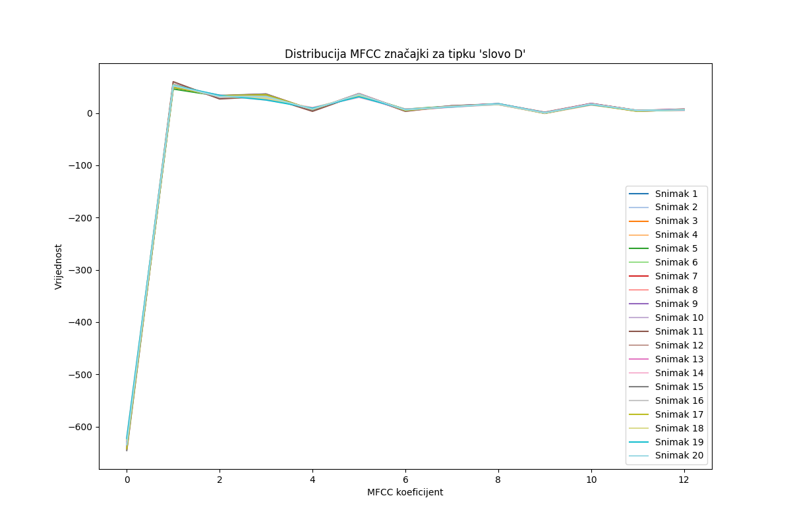
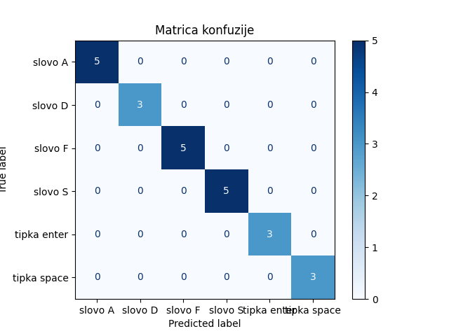

# Speech Recognition for Keyboard Inputs

## 📌 Project Overview  
This project focuses on speech recognition for detecting specific keyboard inputs. The goal is to analyze and classify audio recordings of spoken letters and keystrokes using **MFCC (Mel-Frequency Cepstral Coefficients)** for feature extraction and machine learning for classification.

## 🔍 Methodology  
1. **Data Collection** – Audio recordings of specific letters and keystrokes were gathered.  
2. **Feature Extraction** – MFCCs were extracted from the audio signals to represent speech characteristics.  
3. **Model Training** – A classification model was trained using machine learning techniques.  
4. **Evaluation** – The model's accuracy was assessed using a **confusion matrix**.  

## 📊 Results  
- **MFCC Analysis**: The extracted features show distinct patterns for different keys.  
- **Confusion Matrix**: Demonstrates the model's accuracy in classifying different inputs.  
- **Accuracy**: *(Include model accuracy here if available)*  

### 🔹 Sample Visualizations  
#### MFCC Feature Distribution  
Example of MFCC feature distribution for a specific key:  
  

#### Confusion Matrix  
Illustrates model classification performance:  
  

## 🚀 Future Improvements  
- Expanding the dataset for better generalization.  
- Exploring deep learning models for improved accuracy.  
- Real-time speech-to-keyboard mapping.  

